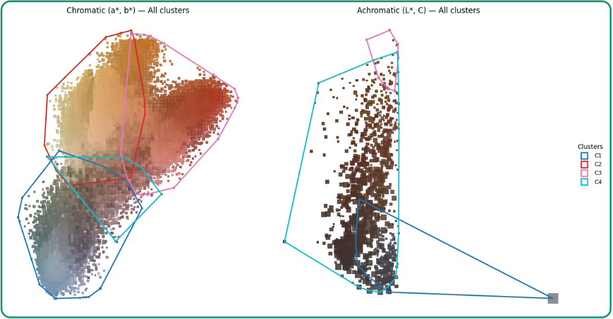

# How to use FLACA (Installing Instructions follow)
After successfully installing FLACA and all dependencies locally on your computer you are able to run it from your console by running 
```bash
uvicorn app:app --reload
```
After the startup has been successful open your favorite browser and head to ttp://localhost:8000. You will be directed to the Homepage where you will have two choices to choose from: 
## Color Analysis
### Overview 
The color analysis tool is dedicated to Flaca. It provides you a breakdown of the used colors of an image by combining the collection of all pixels in a predefined ab-grid in CIELab space. For now pixels are stacked for their color values (a,b) only and the Lightness value L is ignored. This offers a more human-friendly visualization of the color palette in the image. Further the color palette is aurtomatically grouped into a number of colors using k-means. This number can be chosen by the user. You will be able to see the colorpalette and the groupings. For every group you can visualize which part of the image is categorized into this color group. Further you will be provided with a percentage number representing the ratio of pixels grouped into the chosen color group. It is important to mention that currently only rectangular 2D objects are supported and the percentage is only valid with respect to the whole picture. This means especially that background is taken into accound which needds to be taken into account. Nevertheless if the background is uniformly colored, simple mathematics will allow you to come up with a reasonable number anyway. More on this later. 
### Uploading a picture
On the page for color analysis you see a **Choose File** Button where you can upload a picture. *HEIC Iphone pictures are to be converted to jpg or png formats. Generally it is not advised to use exotic formats. The error handling is not very extensive and hasn't been tested thoroughly. In the case an error followed by unexpected behaviour simply restart the program. 
### Select number of Colors (k)
This part is the most crucial part in this section. Look at the picture and come up with a number of colors you want to have your image grouped in. Since the grouping is performed automatically based on how "far" the colors are from each other try to come up with groupings where all the colors within a group look similar and the colors in the groups are distinct from each other. Sometimes it might help to run the analysis with an arbitrary number of color to see the palette and the initial groupings for getting a feeling of how the groups are done. 

In this example we choose to group into four color clusters: 
1. Red 
2. Blue
3. lighter Brown
4. darker Brown
### Advanced Settings
#### Currently implemented 
1. pie_show_labels deactivate if you want to see the pie chart labels
2. show_input plots the input image
3. show_plots_initial lets you see the ungrouped color charts on the initial Lab grid for a finegrained color distinction without grouping. 
4. show_plots_final Shows the grouped colors.
5. random_seed determines the randomness for reproduction. Algorithms like K-Means for grouping use random seed pixels as starting points. If you want to have reproducable results use a number and pass it to the person verifying your results.
6. shrink_img shrinks the image by this factor for speed. Default is 0.1 which is a lot but sufficient for 4k images. If you have resolutions about 1000x1000 try with 1.0. If you have resulutions above 4k try with 0.1 to 0.05. This number heavily determines the speed of the program. Lower number -> Faster but lower precision. Higher Number (maximal 1.0) -> slower but higher precision.
7. ab_step defined how finegrained your initial Lab grid is. The bigger the number the more you force the colors into the predefined grid because the grid "tiles" are bigger. Around 1 has proven to be a good number. 
#### Under developement
These variables are active and have a change on the analysis
1. top_n_chroma limit the chromatic colors to an upper limit. This is experimental.
2. top_n_achro limit the achromatic colors to an upper limit. This is experimental
3. L_thres Threshold for what is considered as a color pixel vs dark pixel
4. C_thresh Threshold for what is considered as a color pixel vs achromatic pixel (white, grey, black etc.) In practise some brownish pixels usually are categorized in this too
5. point_size 
6. size_mode

### Results (Final Plots)
#### Grouping

This Plot shows the color palette and the grouping into the desired number of colors. As mentioned above the grouping is done automatically on euclidean color distance in LAB space. There are two palettes to be more precise. One for the chromatic pixels and one for achromatic ones. The groupings are symbolized by the color boundaries 


# How to Install FLACA (for Total Beginners)

This guide explains *exactly* how to set up and run this Python web app using **Uvicorn** — even if you’ve never programmed before.  
Follow every step carefully, and you’ll have the app running locally in your browser!

---

## What This App Is
This project runs a **FastAPI / Uvicorn** web server.  
Once it’s running, you can open your browser and visit:

**http://localhost:8000**

That’s where your app will appear.

You will run it using the following command:

```bash
uvicorn app:app --reload
```

---

## Step 0 — Get the Code from GitHub

You’ll first need to download or clone the project from GitHub.  
The link will be provided later (for example):

```
https://github.com/USERNAME/FLACA
```

### Steps:

1. Create a folder called **FLACA** anywhere on your computer (for example, on your Desktop).  
2. Open your browser and go to the GitHub repository link.  
3. Click the green **“Code”** button → **“Download ZIP”**.  
4. Unzip the downloaded file.  
5. Move all the extracted files into your **FLACA** folder.  

Your folder structure should look something like this:

```
FLACA/
 ├── app.py
 ├── requirements.txt
 ├── README.md
 └── (other project files...)
```

---

## Quick Overview of What We’ll Do

1. Install **Python 3**
2. Create a **folder named FLACA**
3. Download the **GitHub project** into it
4. Create a **virtual environment**
5. Install all required **packages**
6. Run the app with **Uvicorn**
7. Open it in your **web browser**

---

## Step-by-Step Instructions
## Understanding the Terminal (Command Line)
Before you can install or run the app, you’ll need to use something called the **terminal** (also known as the **command line** or **console**).  
Don’t worry — it’s just a simple window where you type commands instead of clicking buttons.

### What Is the Terminal?

Think of the terminal as a text-based control center for your computer.  
Instead of using your mouse, you type instructions directly — for example, to install Python packages, start your app, or navigate folders.

When you see instructions like this in the README:

```bash
uvicorn app:app --reload
```
it means you’ll type or paste that line into your terminal and press Enter.

### How to Open the Terminal
#### Windows
You have a few easy options:

Press Windows key + R, type cmd, and press Enter → opens Command Prompt

Or click Start → type “cmd” → press Enter

Or use PowerShell (works the same): click Start → type “PowerShell” → press Enter

Once open, you’ll see something like:
```bash
C:\Users\YourName>
```
That’s your terminal waiting for a command.

#### macOS
Open Finder

Go to Applications → Utilities

Double-click Terminal

Alternatively, press ⌘ + Space to open Spotlight, type “Terminal”, and hit Enter.

You’ll see something like:
```bash
MacBook-Air:~ yourname$
```
#### Linux
Most Linux systems already have Terminal installed.

Press Ctrl + Alt + T

Or open it from your application menu

You’ll see something like:

```bash
user@computer:~$
```
### What You’ll Use the Terminal For
Throughout this guide, you’ll use the terminal to:

Navigate to your project folder  
```bash 
cd FLACA
```
Create a virtual environment 
```bash 
python -m venv .venv
```

Activate the environment 
```bash 
source .venv/bin/activate or .venv\Scripts\activate
```

Install the necessary packages 
```bash
pip install -r requirements.txt
```

Run the app 
```bash 
uvicorn app:app --reload
```

That’s it! Every command in this guide should be typed or pasted into the terminal and executed by pressing Enter.

If you make a typo, just press the Up Arrow key to recall the last command, fix it, and hit Enter again.
### Install Python
You need **Python 3.9 or newer**.

- **Windows:**  
  Download and install from [python.org/downloads](https://www.python.org/downloads/).  
  **IMPORTANT:** Check the box “Add Python to PATH” during installation!

- **Mac:**  
  Use [python.org/downloads](https://www.python.org/downloads/) or run:
  ```bash
  brew install python
  ```

- **Linux (Ubuntu example):**
  ```bash
  sudo apt update
  sudo apt install python3 python3-venv python3-pip
  ```

Check that Python is installed using the terminal with the commands below:
```bash
python --version
```
or (on some systems)
```bash
python3 --version
```

You should see something like:
```
Python 3.10.12
```

---

### Navigate to the FLACA Folder

Once you’ve downloaded the GitHub code and placed it in your **FLACA** folder, open a terminal:

- **Windows:** Open the folder in File Explorer, type `cmd` in the path bar, press Enter.  
- **Mac/Linux:** Open Terminal and run:
  ```bash
  cd /path/to/FLACA
  ```

Example (Mac):
```bash
cd ~/Desktop/FLACA
```

Example (Windows):
```cmd
cd %USERPROFILE%\Desktop\FLACA
```
/path/to/FLACA means that to have to actually enter the path and not type 'path/to/FLACA'. If you are unsure what the path is exactly go the folder FLACA rightclick on it and copy path.

---

### Create a Virtual Environment

This keeps the app’s dependencies separate from your system. Use the same terminal as you just opened above.

#### On macOS / Linux:
```bash
python3 -m venv .venv
source .venv/bin/activate
```

#### On Windows (Command Prompt):
```cmd
python -m venv .venv
.venv\Scripts\activate
```

#### On Windows (PowerShell):
```powershell
python -m venv .venv
.venv\Scripts\Activate.ps1
```

If you see `(.venv)` at the start of your terminal prompt, the environment is active.

---

### Install Required Packages

Now that your environment is active, install all the necessary packages.

run:

```bash
pip install -r requirements.txt
```

---

### Run the App 

With everything set up, start the app by running:

```bash
uvicorn app:app --reload
```

If that doesn’t work, try:

```bash
python -m uvicorn app:app --reload
```

You should see a message like:

```
INFO:     Uvicorn running on http://127.0.0.1:8000 (Press CTRL+C to quit)
```

---

### Open the App in Your Browser

Go to:

[http://localhost:8000](http://localhost:8000)

---

### Stop the Server

When you’re done, stop the app by pressing in the terminal:

```
CTRL + C
```

That stops the running server.

---

## Common Problems and Fixes

| Problem | What to Do |
|----------|-------------|
| `'python' is not recognized` | Try using `python3` instead of `python`. |
| `'pip' command not found` | Use `python -m pip install ...` |
| `ModuleNotFoundError: No module named 'uvicorn'` | Run `pip install "uvicorn[standard]"` again inside `.venv`. |
| `AttributeError: module 'app' has no attribute 'app'` | Make sure `app.py` exists and defines a variable called `app`. |
| `Address already in use` | Use a different port: `uvicorn app:app --reload --port 5001` |
| Browser won’t connect | Ensure Uvicorn is running and not blocked by a firewall. |


---

## Final Quick Summary

To recap, here’s everything in one place:

```bash
# 1. Create a folder
mkdir FLACA
cd FLACA

# 2. Download or unzip your GitHub code here

# 3. Create and activate virtual environment
python -m venv .venv
.venv\Scripts\activate     # (Windows)
source .venv/bin/activate    # (Mac/Linux)

# 4. Install dependencies
pip install -r requirements.txt

# 5. Run the server
uvicorn app:app --reload

# 6. Open in browser
http://localhost:8000
```

That’s it!  
You’ve successfully installed and run your **FLACA Uvicorn App** locally.