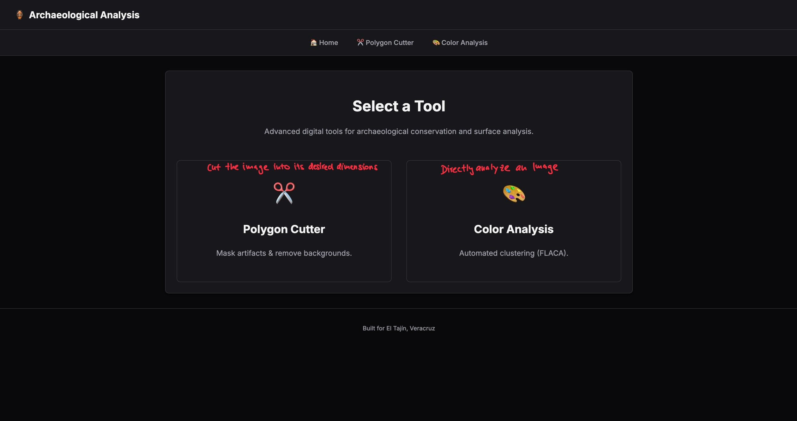
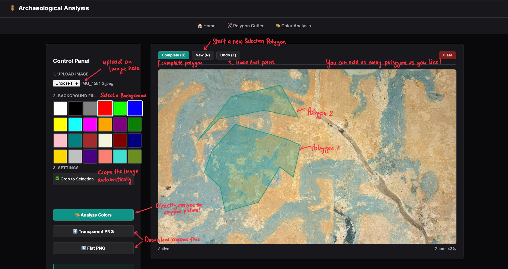
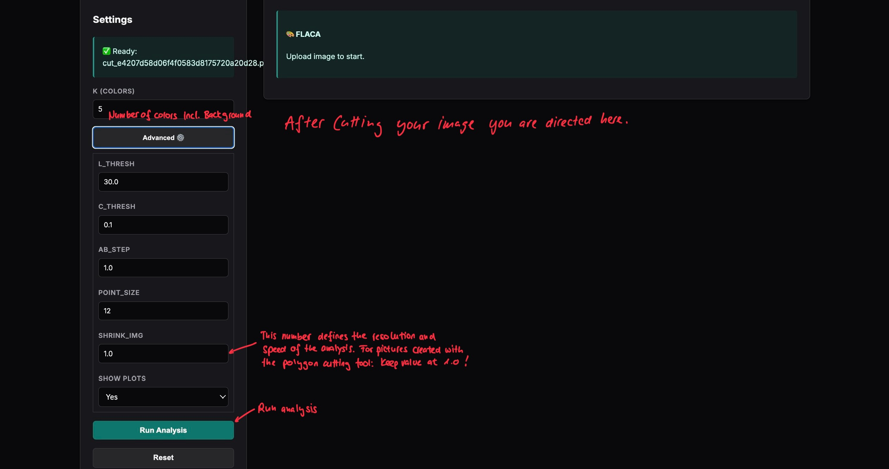
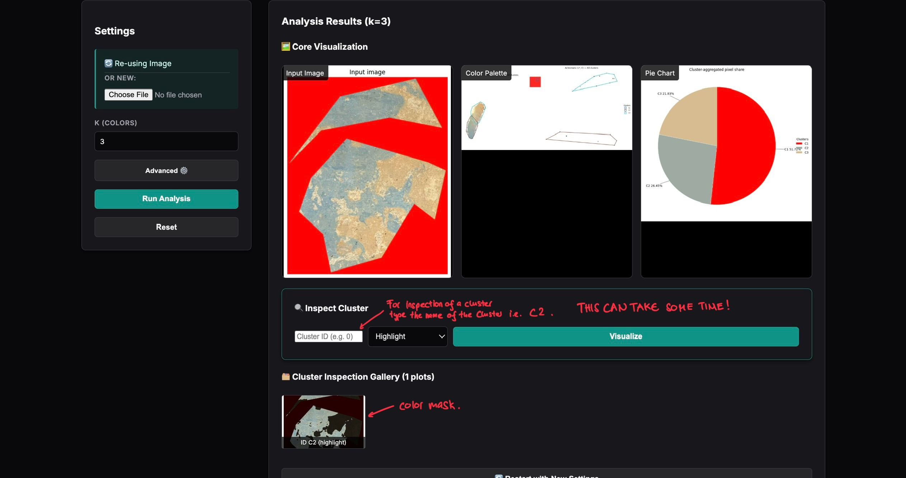

# How to use FLACA (Installing Instructions follow)
After successfully installing FLACA and all dependencies locally on your computer you are able to run it from your console by running 
```bash
uvicorn app:app --reload
```
After the startup has been successful open your favorite browser and head to ttp://localhost:8000. You will be directed to the Homepage where you will have two choices to choose from: 
## Color Analysis
### Overview 
The color analysis tool is dedicated to Flaca. It provides you a breakdown of the used colors of an image by combining the collection of all pixels in a predefined ab-grid in CIELab space. For now pixels are stacked for their color values (a,b) only and the Lightness value L is ignored. This offers a more human-friendly visualization of the color palette in the image. Further the color palette is aurtomatically grouped into a number of colors using k-means. This number can be chosen by the user. You will be able to see the colorpalette and the groupings. For every group you can visualize which part of the image is categorized into this color group. Further you will be provided with a percentage number representing the ratio of pixels grouped into the chosen color group. It is important to mention that currently only rectangular 2D objects are supported and the percentage is only valid with respect to the whole picture. This means especially that background is taken into accound which needds to be taken into account. Nevertheless if the background is uniformly colored, simple mathematics will allow you to come up with a reasonable number anyway. More on this in the technical description.
### Uploading a picture
On the page for color analysis you see a **Choose File** Button where you can upload a picture. *HEIC Iphone pictures are to be converted to jpg or png formats. Generally it is not advised to use exotic formats. The error handling is not very extensive and hasn't been tested thoroughly. In the case an error followed by unexpected behaviour simply restart the program by shutting down the server completely and restart. 
### Select number of Colors (k)
This part is the most crucial part in this section. Look at the picture and come up with a number of colors you want to have your image grouped in. Since the grouping is performed automatically based on how "far" the colors are from each other try to come up with groupings where all the colors within a group look similar and the colors in the groups are distinct from each other. Sometimes it might help to run the analysis with an arbitrary number of color to see the palette and the initial groupings for getting a feeling of how the groups are done. 
####  IMPORTANT
In the case of using a picture with a Background, count the background as a color too and use a color which is as distant from the colors in th picture as possible. 

### Advanced Settings
#### Currently implemented 
1. pie_show_labels deactivate if you want to see the pie chart labels
2. show_input plots the input image
3. show_plots_initial lets you see the ungrouped color charts on the initial Lab grid for a finegrained color distinction without grouping. 
4. show_plots_final Shows the grouped colors.
5. random_seed determines the randomness for reproduction. Algorithms like K-Means for grouping use random seed pixels as starting points. If you want to have reproducable results use a number and pass it to the person verifying your results.
6. shrink_img shrinks the image by this factor for speed. Default is 0.1 which is a lot but sufficient for 4k images. If you have resolutions about 1000x1000 try with 1.0. If you have resulutions above 4k try with 0.1 to 0.05. This number heavily determines the speed of the program. Lower number -> Faster but lower precision. Higher Number (maximal 1.0) -> slower but higher precision.
7. ab_step defined how finegrained your initial Lab grid is. The bigger the number the more you force the colors into the predefined grid because the grid "tiles" are bigger. Around 1 has proven to be a good number. 
#### Under developement
These variables are active and have a change on the analysis
1. top_n_chroma limit the chromatic colors to an upper limit. This is experimental.
2. top_n_achro limit the achromatic colors to an upper limit. This is experimental
3. L_thres Threshold for what is considered as a color pixel vs dark pixel
4. C_thresh Threshold for what is considered as a color pixel vs achromatic pixel (white, grey, black etc.) In practise some brownish pixels usually are categorized in this too
5. point_size 
6. size_mode

## Polygon Cutting tool
For pictures which despict objects which are orthogonal to the camera, but not a rectangular object you can use the polygon cutting tool in order to cut out the desired area in any polygon and as many you want. From there you can head directly to the color analysis. 

# Screen Shots 





